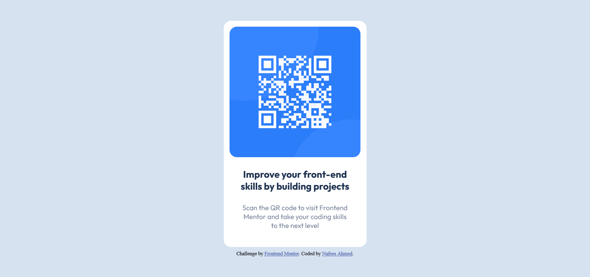

# Frontend Mentor - QR code component solution

This is a solution to the [QR code component challenge on Frontend Mentor](https://www.frontendmentor.io/challenges/qr-code-component-iux_sIO_H). Frontend Mentor challenges help you improve your coding skills by building realistic projects. 

## Table of contents

## Overview

### Screenshot

-Desktop at 1280px  

### Links

- Solution URL: [https://github.com/NAFEE5Ahmed/qr-code-component-main](https://github.com/NAFEE5Ahmed/qr-code-component-main)
- Live Site URL: [https://nafee5ahmed.github.io/qr-code-component-main/](https://nafee5ahmed.github.io/qr-code-component-main/)

## My process

### Built with

- Semantic HTML5 markup
- CSS custom properties
- Flexbox
- Mobile-first workflow

### What I learned

- I learned the advanced use of Flexbox
- I used flexbox in every container to ensure that I can manipulate and create any kind of design using flexbox

### Continued development

- I over used flexbox in this project
- I need to strong the understanding of grid in css for using flexbox and grid interchangeably to make a webpage interactive

## Author

- Website - [Nafees Ahmed]()
- Frontend Mentor - [@NAFEE5Ahmed](https://www.frontendmentor.io/profile/NAFEE5Ahmed)
- Twitter - [@NafeesAhmed__](https://twitter.com/NafeesAhmed__)

